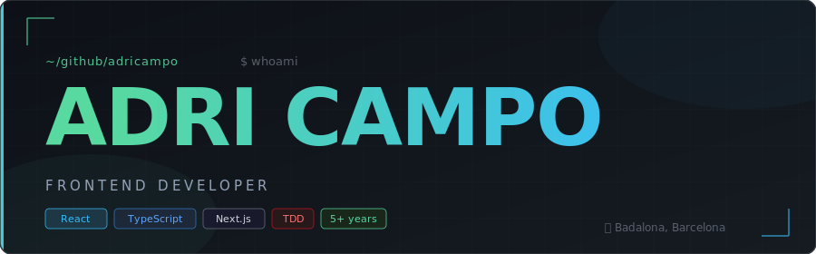

<div align="center">



[](https://www.linkedin.com/in/adricampo)
[](mailto:adribdn7@gmail.com)
[](https://maps.google.com/?q=Badalona)

</div>

---

## `👤 A little more about me:`

```ts
const adri: Developer = {
  name:       "Adrián Campo",
  role:       "Frontend Developer",
  experience: "5+ years",
  based:      "Badalona, Barcelona 🌊",
  origin:     "Industrial Engineer → Project Manager → Frontend Dev 🔄",

  currentFocus: ["React", "TypeScript", "Next.js", "TDD", "DDD"],
  
  values: [
    "beginner's mindset",
    "analytical thinking",
    "continuous improvement",
    "proactive attitude",
  ],

  funFact: "I traded supply chains for component trees — no regrets.",
};
```

---

## `🛠️ Tech Stack`

<div align="center">

| Layer | Stack |
|:------|:------|
| **Frontend** |          |
| **Backend** |     |
| **Testing** |    |
| **CMS** |    |
| **Tooling** |     |

</div>

---

## `📈 Career path`

```
[  present  ]     🔍  Open to new challenges
      │
[2020 - 2025]     💻  Frontend Developer @ Leadtech Group · Barcelona
      │              ↳ React + Next.js apps in production
      │              ↳ TDD with Jest & React Testing Library
      │              ↳ Light DDD: domain / business / presentation layers
      │
[2019 - 2020]     🎓  FullStack Bootcamp @ ISDI Coders · Barcelona
      │              ↳ The pivot point. No looking back.
      │
[2017 - 2019]     📦  Distribution Planning Manager @ Mondelez International
      │
[2017 - 2017]     🏭  Project & Operations Manager @ Logisfashion · Barcelona
      │
[2017 - 2018]     🎓  Master in Project Management @ UPC · Barcelona
      │
[2016 - 2017]     🏭  Distribution Planning Jr. Manager @ MANGO · Barcelona
      │
[2016 - 2016]     🔬  Quality & Risk Prevention Intern @ Danone Waters · Barcelona
      │
[2015 - 2016]     ✈️  Exchange semester @ Hochschule München 🇩🇪
      │
[2012 - 2016]     🎓  BSc Industrial Engineering @ UAB · Barcelona
```

---

## `🌐 Languages`

| Language | Level |
|:---------|:------|
| 🟢 Catalan | Native |
| 🟢 Spanish | Native |
| 🔵 English | Advanced |
| 🟡 German | Basic |

---

<div align="center">

*« From managing supply chains to shipping features — I just optimized for a better stack. »*

**Let's build something great together.**
[](https://www.linkedin.com/in/adricampo)
[](mailto:adribdn7@gmail.com)

</div>
